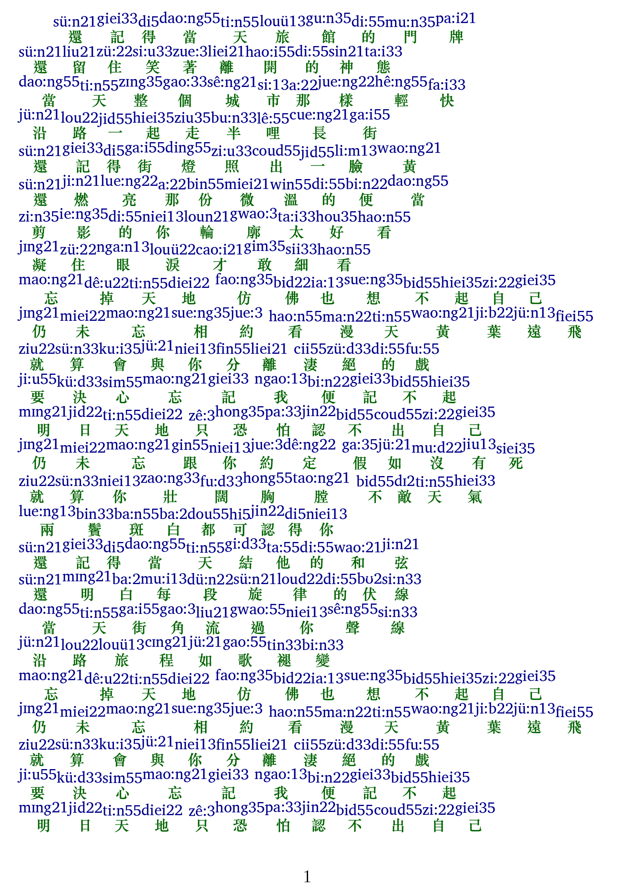

# yue2latex

This repository provides tools to convert Cantonese text into IPA (International Phonetic Alphabet) or Pinyin, and further into LaTeX format for displaying phonetic annotations above the text.  This allows for easy integration into LaTeX documents, especially useful for linguistic studies or educational materials. You can render the generated LaTeX code in applications like TeXstudio to visualize the annotations.  This repository also includes the conversion rules between IPA and Pinyin.

该仓库提供工具，用于将粤语文本转换为国际音标（IPA）或拼音，并进一步转换为 LaTeX 格式，以便在文本上方显示语音注释。 这对于将其轻松集成到 LaTeX 文档中非常有用，尤其适用于语言学研究或教育材料。 你可以在 TeXstudio 等应用程序中渲染生成的 LaTeX 代码以可视化注释。 此仓库还包含 IPA 和拼音之间的转换规则。

## Features

* Cantonese to IPA conversion
* Cantonese to Pinyin conversion
* IPA to Pinyin conversion
* Output in LaTeX format for easy integration with TeXstudio and other LaTeX editors.

## 功能

* 粤语到IPA的转换
* 粤语到拼音的转换
* IPA到拼音的转换
* 以 LaTeX 格式输出，方便与 TeXstudio 和其他 LaTeX 编辑器集成。

## Example / 示例

## Conversion Rules / 转换规则

The Cantonese to IPA conversion rules are based on the work from [lotusfa/IPA-Translator](https://github.com/lotusfa/IPA-Translator).  

粤语到 IPA 的转换规则基于 [lotusfa/IPA-Translator](https://github.com/lotusfa/IPA-Translator) 中的工作。 

## Limitations / 局限性

Currently, this tool does not handle polyphonic characters (characters with multiple pronunciations) perfectly.  It only selects the first conversion rule encountered for a polyphonic character.

目前，此工具不能完美地处理多音字。它只为多音字选择遇到的第一个转换规则。